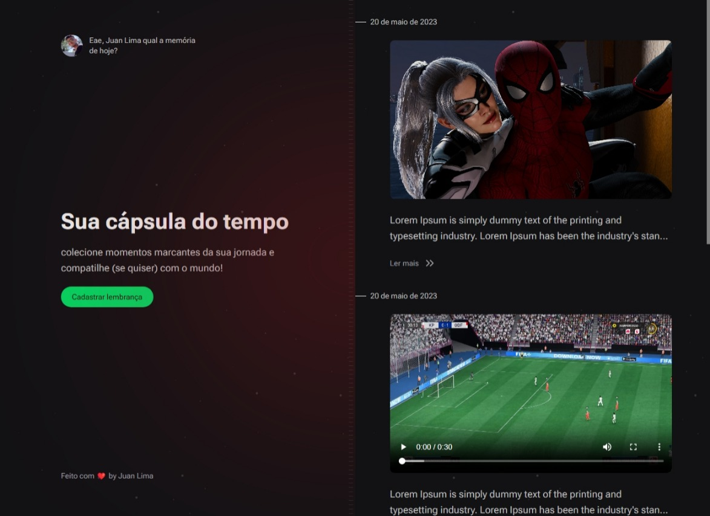

# Spacetime NLW

<p align="center">
  <a href="https://nextjs.org" target="blank">
    
  </a>
</p>

  <p align="center">A progressive <a href="https://nextjs.org" target="_blank">Next.js</a> framework for building efficient and scalable web applications.</p>

## Installation

```bash
#server and web
$ npm install
```

## Running the app

```bash
# development
$ npm run start

# watch mode
$ npm run dev

# production mode
$ npm run build
```

</br>

> Status: Finalizado

</br>

## WebSite desenvolvido junto a Rockeseat para aprender mais sobre o framework Next.js 13.

<br/>

## 🧪 Technologies used

+ Next
+ Node
+ Prisma
+ SQLite
+ Tailwind
+ TypeScript
